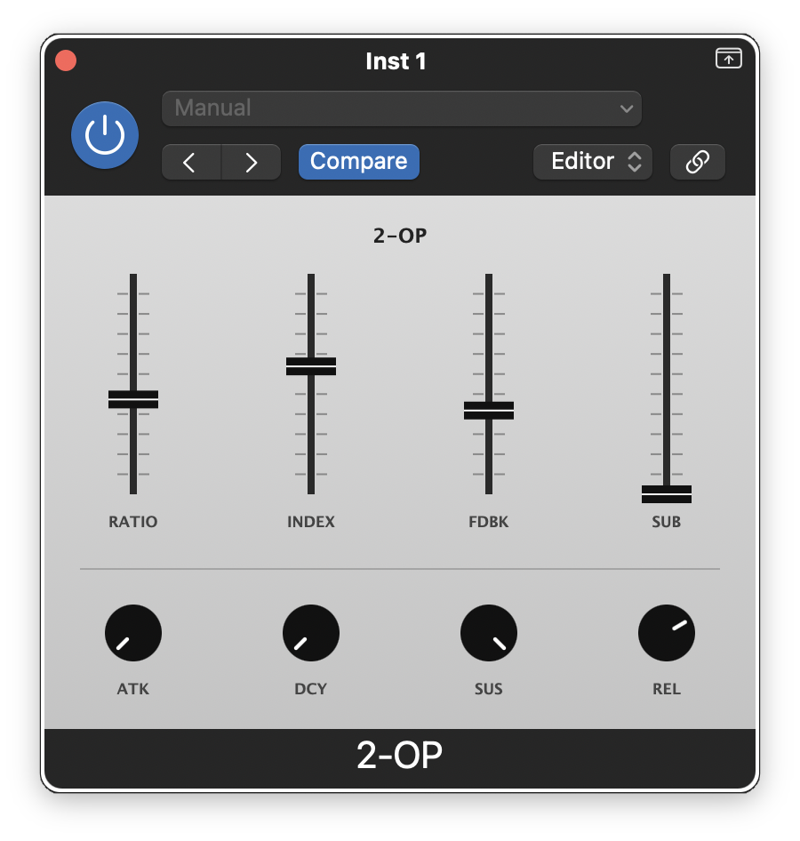
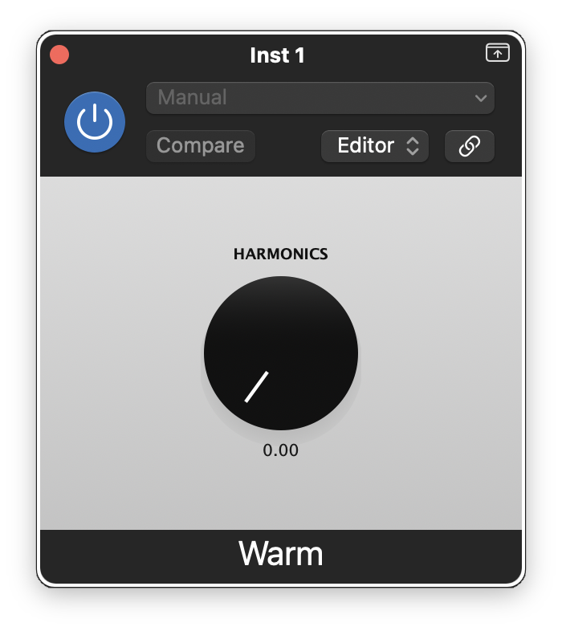

# DSP Plugins

A collection of macOS Audio Unit plugins built with [JUCE](https://juce.com).

| Plugin | Type | Description |
|--------|------|-------------|
| [2-OP](#2-op) | AU Instrument | 2-operator FM synthesizer |
| [Warm](#warm) | AU Effect | Odd-harmonic tanh waveshaper |

---

## 2-OP



A monophonic 2-operator FM synthesizer. The DSP engine is the `FMEngine` from [Mutable Instruments Plaits](https://github.com/pichenettes/eurorack), adapted for standard sample rates and wrapped with a custom ADSR envelope. MIDI is handled sample-accurately; pitch bend is ±2 semitones.

**Parameters**

| Parameter | Description |
|-----------|-------------|
| Ratio | Modulator-to-carrier frequency ratio |
| Index | Modulation depth |
| Feedback | Operator self-feedback |
| Sub | Blend of sub-octave carrier output |
| Attack / Decay / Sustain / Release | Amplitude envelope (skewed time ranges for musical feel) |

**Format**: AU Instrument (`aumu`) · `com.CorvidAudio.TwoOpFM`

---

## Warm



An odd-harmonic waveshaper modelled on the `tanh` function. Because `tanh` is an odd function, it produces only odd-order harmonics (3rd, 5th, 7th…), giving a warm, tube-like character. A single **Harmonics** knob sweeps drive from subtle saturation to extreme clipping, with an exponential taper for musical response across the full range.

**Parameters**

| Parameter | Range | Description |
|-----------|-------|-------------|
| Harmonics | 0–100 % | Drive amount (log taper, 0.5 → 20.0 internal) |

**Format**: AU Effect (`aufx`) · `com.CorvidAudio.OddHarmonics`

---

## Building

### Requirements

- macOS 11.0+, arm64 or x86_64
- Xcode Command Line Tools (`xcode-select --install`)
- CMake ≥ 3.22 (`brew install cmake ninja`)
- [JUCE](https://github.com/juce-framework/JUCE) cloned to `~/src/github/JUCE`
- [eurorack](https://github.com/pichenettes/eurorack) cloned to `~/src/github/eurorack` (required by 2-OP only)

### 2-OP

```bash
cd 2-OP
cmake -B build -G Ninja \
    -DCMAKE_OSX_ARCHITECTURES="arm64;x86_64" \
    -DCMAKE_OSX_DEPLOYMENT_TARGET=11.0 \
    -DCMAKE_BUILD_TYPE=Release \
    -DCMAKE_C_COMPILER=$(xcrun -f clang) \
    -DCMAKE_CXX_COMPILER=$(xcrun -f clang++)
cmake --build build --config Release

# Install and validate
cp -R build/TwoOpFM_artefacts/Release/AU/2-OP.component \
      ~/Library/Audio/Plug-Ins/Components/
codesign --force --sign - ~/Library/Audio/Plug-Ins/Components/2-OP.component
auval -v aumu TWOP CVDA
```

### Warm

```bash
cd Warm
cmake -B build -G Ninja \
    -DCMAKE_OSX_ARCHITECTURES="arm64;x86_64" \
    -DCMAKE_OSX_DEPLOYMENT_TARGET=11.0 \
    -DCMAKE_BUILD_TYPE=Release \
    -DCMAKE_C_COMPILER=$(xcrun -f clang) \
    -DCMAKE_CXX_COMPILER=$(xcrun -f clang++)
cmake --build build --config Release

# Install and validate
cp -R build/OddHarmonics_artefacts/Release/AU/Warm.component \
      ~/Library/Audio/Plug-Ins/Components/
codesign --force --sign - ~/Library/Audio/Plug-Ins/Components/Warm.component
auval -v aufx ODDH CVDA
```

---

## License

Copyright © 2026 Corvid Audio

This project is licensed under the **GNU General Public License v3.0** — see [LICENSE](LICENSE) for the full text.

The 2-OP plugin incorporates source code from [Mutable Instruments Eurorack](https://github.com/pichenettes/eurorack) (© Émilie Gillet), which is also licensed under GPL-3.0. JUCE is used under its [GPL-3.0 open-source licence](https://github.com/juce-framework/JUCE/blob/master/LICENSE.md).
